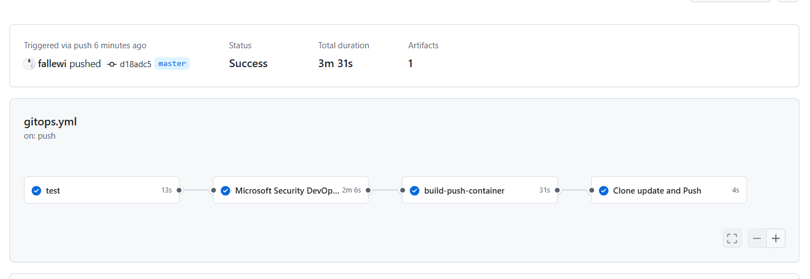

# DEMO  GITOPS DATASCIENTEST BY FALL LEWIS


[](https://github.com/fallewi/gitops-api/actions/workflows/gitops.yml)

# Introduction

In the rapidly evolving landscape of software development and deployment, organisations are constantly seeking more efficient ways to manage their application lifecycle. Traditional methods of manual deployments and continuous integration and continuous delivery (CI/CD) pipelines have proven to be time-consuming and error-prone. Enter GitOps, a modern approach to software delivery that leverages the power of version control systems and automation to streamline the deployment process.


GitOps shifts the paradigm by using Git as the single source of truth for both application code and infrastructure configuration. By adopting GitOps principles, organisations can achieve greater visibility, traceability, and scalability in their deployments. In this article, we will explore the integration of GitOps with CI/CD pipelines, specifically focusing on the combination of GitHub Actions and Argo CD.

By combining the strengths of GitHub Actions and Argo CD, organizations can achieve a powerful end-to-end CI/CD pipeline that embraces the GitOps philosophy. Developers can make changes to their codebase, commit them to the main branch, and trigger a series of automated actions that build, test, and deploy the application to the desired environment.

# Getting Started

Here’s a high-level overview of how to set it up:

1\. Git Repository: Create a Git repository to store your application code.

2\. GitHub Actions: Configure GitHub Actions by creating a workflow file in the repository’s .github/workflows/ directory. We will use the GitHub workflow to trigger the build image, push the image to the DockerHub and modify the Kubernetes manifest file as required for the deployment.

3\. Create a Kubernetes cluster: Set up a Kubernetes cluster. I will be using NKE(Nutanix Kubernetes Engine). Ensure that you have the necessary permissions and access to manage the cluster.

4\. Install Argo CD: Install Argo CD on the K8s cluster and configure it to connect to your Git repository which contains manifest files.

5\. Define Argo CD application: Define an Argo CD application to manage the deployment of your Kubernetes resources. Enable automatic synchronization so that Argo CD can detect changes in the Git repository and trigger deployments accordingly.

6\. Deploy applications with Argo CD: Argo CD will automatically detect changes to the Git repository and deploy the updated application on the Kubernetes cluster.

## The Workflow


In the image above, you can observe the seamless integration. You can see I am using **GitHub Actions** to build a Docker Image of the application and then push the image to a **DockerHub** repository. And then update the version of the new image in the Manifest Git repo. We will be setting up two repositories one for the application code, and another for the Kubernetes manifests.

Every time your code is changed in the [Application repository]((https://github.com/fallewi/gitops-cicd), a new Docker container image will be created, pushed to the DockerHub and it will update the image tag in the Kubernetes [Manifest repository](https://github.com/fallewi/gitops-manifests.git).

As soon as a change is detected in the Kubernetes Manifest repository, ArgoCD comes into action and starts rolling out and deploying the new application in the Kubernetes cluster. It ensures that the new version of our application is seamlessly deployed, eliminating any manual intervention or potential human errors.

## Implementation

We first have to create a GitHub repository and put the application source code in it.

For the [Application source code repository](https://github.com/fallewi/gitops-cicd), we will be using a simple Flask application that displays a web page and this will be packaged in a docker image and published to the DockerHub.


For the [Kubernetes Manifest repository](https://github.com/fallewi/gitops-manifests.git), we will use a simple deployment and service K8s manifest.


Above manifest file defines a Kubernetes deployment and service for a Flask application. The deployment will create a single replica of the application, which will be exposed on port 5000. The service will expose the application on port 80 and will be accessible via the NodePort 30001.

Next, we need to set up GitHub Actions in the [Application repository](https://github.com/fallewi/gitops-cicd/) to build the Docker image from the Dockerfile present in the repository and then push the image to the DockerHub repository.

To create a workflow, select the GitHub repository, click Actions, and select “Set up a workflow yourself.” This will create a YAML file at path `.github/workflows/main.yml`. This is the only file that we need to create and modify in the GitOps phase.


Here is the workflow file
```
name: Fast-API CI
on:
  push:
    branches: [ master ]
  pull_request:
    branches: [ master ]
env:
  dockerhub_id: fallewi
  dockerhub_repository: fastapi
  dockerhub_latest: latest
  container: webinar
permissions:
  security-events: write
jobs:
  test:
    runs-on: ubuntu-latest
    steps:
    - uses: actions/checkout@v3
    - name: Test python Code
      run: | 
        pip3 install -r requirements.txt 
        cd app/
        pytest

  secure:
    needs: test
    name: Microsoft Security DevOps Analysis
    # MSDO runs on windows-latest.
    # ubuntu-latest also supported
    runs-on: windows-latest
    steps:
      # Checkout your code repository to scan
    - uses: actions/checkout@v3
      # Run analyzers
    - name: Run Microsoft Security DevOps Analysis
      uses: microsoft/security-devops-action@latest
      id: msdo
      with:
        policy: 'GitHub'
      # config: string. Optional. A file path to an MSDO configuration file ('*.gdnconfig').
      # policy: 'GitHub' | 'microsoft' | 'none'. Optional. The name of a well-known Microsoft policy. If no configuration file or list of tools is provided, the policy may instruct MSDO which tools to run. Default: GitHub.
      # categories: string. Optional. A comma-separated list of analyzer categories to run. Values: 'secrets', 'code', 'artifacts', 'IaC', 'containers. Example: 'IaC,secrets'. Defaults to all.
      # languages: string. Optional. A comma-separated list of languages to analyze. Example: 'javascript,typescript'. Defaults to all.
      # tools: string. Optional. A comma-separated list of analyzer tools to run. Values: 'bandit', 'binskim', 'eslint', 'templateanalyzer', 'terrascan', 'trivy'.

      # Upload alerts to the Security tab
    - name: Upload alerts to Security tab
      uses: github/codeql-action/upload-sarif@v2
      with:
        sarif_file: ${{ steps.msdo.outputs.sarifFile }}

      # Upload alerts file as a workflow artifact
    - name: Upload alerts file as a workflow artifact
      uses: actions/upload-artifact@v3
      with:  
        name: alerts
        path: ${{ steps.msdo.outputs.sarifFile }}
    
  build-push-container:
    needs: secure
    runs-on: ubuntu-latest
    steps:
    - uses: actions/checkout@v3
    - name: Build the Docker image
      run: | 
        docker build -t $dockerhub_id/$dockerhub_repository:${GITHUB_SHA} .
        docker tag  $dockerhub_id/$dockerhub_repository:${GITHUB_SHA} $dockerhub_id/$dockerhub_repository:$dockerhub_latest
        docker images
        docker run -d -p 80:80 --name $container $dockerhub_id/$dockerhub_repository:${GITHUB_SHA}
        sleep 10
        curl localhost 
        docker login -u ${{ secrets.REGISTRY_USER  }} -p ${{ secrets.REGISTRY_PASSWD  }}
        docker push $dockerhub_id/$dockerhub_repository:${GITHUB_SHA}
        docker push $dockerhub_id/$dockerhub_repository:$dockerhub_latest
  update-push:
    needs: build-push-container
    name: Clone update and Push
    runs-on: ubuntu-latest
    steps:
    - uses: actions/checkout@v3
    - name: Setup SSH
      uses: MrSquaare/ssh-setup-action@v1
      with:
          host: github.com
          private-key: ${{ secrets.PRIVATE_KEY }}
          
    - name: Clone repository
      run: |
        rm -Rf *
        git clone git@github.com:fallewi/gitops-manifests.git
        ls
        cd gitops-fleet-helm/
        cat values.yaml
        sed -i "s+tag.*+tag: ${GITHUB_SHA}+g" values.yaml
        cat values.yaml
    - name: Commit and push changes
      run: |
        ls
        cd gitops-fleet-helm
        git config --global user.name "Fall lewis"
        git config --global user.email "fall-lewis.y@datascientest.com"
        git add -A
        git commit -m "mis à jour de l'image avec le tag ${GITHUB_SHA}"
        git push origin master
```

The above Git workflow file defines a workflow that will run on every push to the main branch. The workflow has three jobs:
-   Test - This job will test the the Python application
-   secure - This job will test the security of the application components and IAC code into the repository
-   build-push-container - This job will build a Docker image for the application and push it to Docker Hub.
-   update-push - This job will modify the deployment manifest in the CICD-Manifest repository to use the newly-pushed Docker image.


The above GitHub repo uses secrets for Docker Hub and Git. To create secrets in a GitHub repo, go to the repository settings, select secrets, and click New repository secret. Give the secret a name and a value, and then you can use it anywhere in the repo. Secrets are encrypted and stored in GitHub, so they are safe from prying eyes. You can use secrets to store any type of sensitive information, such as API keys, passwords, and tokens.


The GitOps CI/CD pipeline is now set up to automate the build, push, and deployment processes. Whenever a commit is made to the main branch of [Application repository](https://github.com/fallewi/gitops-cicd/), the pipeline will be triggered automatically. It performs the following actions:

1.  Builds and pushes the Docker image - The pipeline uses the Dockerfile in the repository to build a Docker image. It then pushes the image to a Docker registry, such as Docker Hub. This step ensures that the latest version of the application is available for deployment.
2.  Updates the version in the manifest repository - The pipeline updates the version of the newly built image in a separate Git repository that holds the deployment manifests. This ensures that the deployment manifests reflect the latest image version.
3.  Triggers ArgoCD deployment - The changes made to the deployment manifest repository automatically trigger ArgoCD, which is a GitOps tool for deploying applications to Kubernetes. ArgoCD uses the updated deployment manifests to deploy the application in the Kubernetes cluster.

The pipeline also provides visibility into the build status, as shown in the accompanying image. This allows you to monitor the success or failure of the CI/CD process.



# Installing ArgoCD in Kubernetes Cluster

To install ArgoCD on an NKE (or any other Kubernetes cluster), you can use the following command:

```
kubectl create namespace argocd
kubectl apply -n argocd -f raw.githubusercontent.com/argoproj/argo-cd/stable/manifests/install.yaml
```

This command will create a namespace called argocd and deploy **ArgoCD** on your Kubernetes cluster using the installation manifests provided by the ArgoCD project. The manifests are fetched from the GitHub repository and applied to the argocd namespace.

After running the installation command, you can verify the deployment by checking the status of the ArgoCD pods:

```
kubectl get pods -n argocd
```

To access the ArgoCD dashboard, I will be using Port Forwarding to access the ArgoCD.

```
kubectl port-forward svc/argocd-server -n argocd 8080:443
```

Access ArgoCD Dashboard from your local machine using the following link if you are on your local machine or use your public ip

[http://127.0.0.1:8080](http://127.0.0.1:8080)


To get the password you may execute the below command in your Kubernetes cluster. (username is admin)

```
<span id="2d99" class="pr li fq pb b bg ps pt l pu pv" data-selectable-paragraph="">kubectl <span class="hljs-operator">-</span>n argocd <span class="hljs-keyword">get</span> secret argocd<span class="hljs-operator">-</span><span class="hljs-keyword">initial</span><span class="hljs-operator">-</span>admin<span class="hljs-operator">-</span>secret <span class="hljs-operator">-</span>o jsonpath<span class="hljs-operator">=</span>"{.data.password}" <span class="hljs-operator">|</span> base64 <span class="hljs-operator">-</span>d</span>
```

Next, we have to create an App in ArgoCD in which we basically define where is our application’s repository located and where to deploy it, and some other small configurations.


The repository URL is the one where we have the [manifest file](https://github.com/tanmaybhandge/App-Manifest-). and the **path** is ./

With the incorporation of ArgoCD into our deployment pipeline, we gain continuous monitoring capabilities for our manifest repository. ArgoCD diligently observes this repository, and whenever changes are detected, it swiftly initiates the synchronization process, ensuring that the latest updates are seamlessly applied to our Kubernetes cluster.


Now click on C**reate** button. This will initiate the creation process of an application in ArgoCD, and an exciting journey begins. ArgoCD diligently takes charge and starts the synchronization process, aiming to seamlessly deploy the resources defined in the manifest file to our Kubernetes cluster.

During this synchronization phase, ArgoCD carefully examines the manifest file and assesses the current state of the Kubernetes cluster. If the resources defined in the manifest file do not already exist in the cluster, ArgoCD leaps into action. It swiftly orchestrates the deployment of these new resources, ensuring that the desired application components are provisioned in the cluster.

This automated process not only saves us valuable time but also eliminates the risk of manual errors that often accompany manual resource creation and deployment.


As we have defined the nodeport service type in the manifest file, we can access the pod using the node port. <WorkerNodeIP:30001>

By entering the appropriate Worker Node IP address and the designated NodePort in a web browser or any applicable tool, we can effortlessly establish a connection to the Pod running our application.


We have successfully implemented a highly efficient CI/CD workflow that is now fully automated. As a result, whenever a developer commits changes to the main branch of the [Application repository](https://github.com/tanmaybhandge/CICD_Application_K8s), the updates are seamlessly reflected on the main site without any manual intervention. This automated process eliminates the need for manual deployments, saving us time and effort. Witnessing this level of automation in action is truly remarkable and highlights the effectiveness of our CI/CD implementation.

I sincerely hope that you have found this article to be an enjoyable and informative read.
